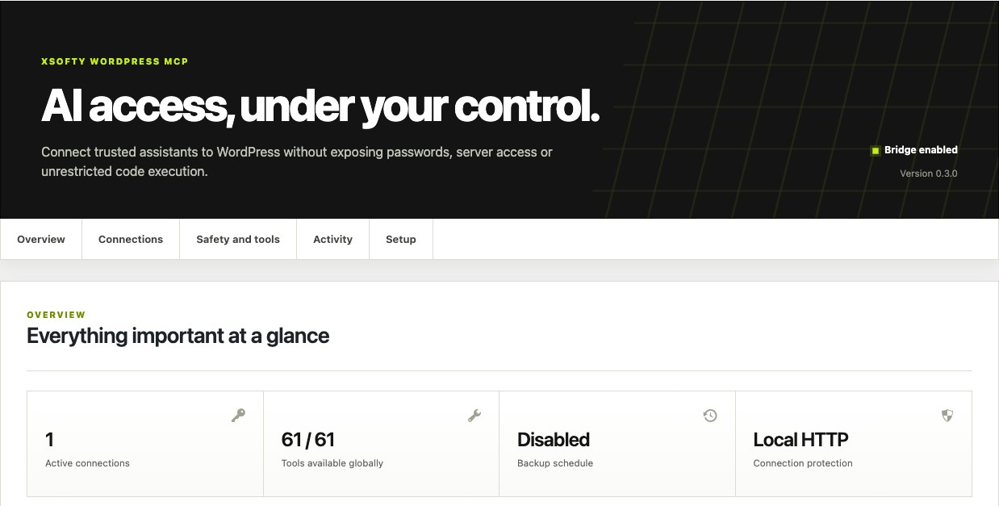
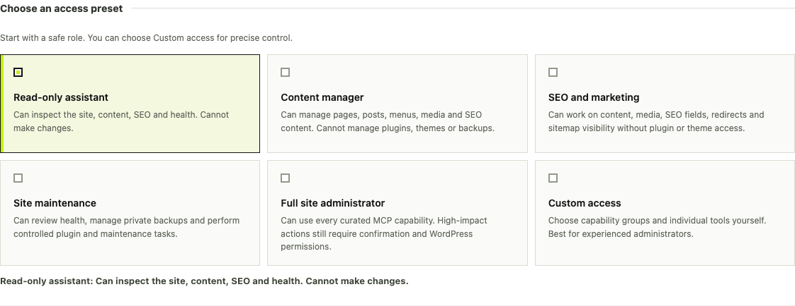

# Xsofty WordPress MCP Bridge

[](https://github.com/ihamzarizvi/xsofty-wordpress-mcp/actions/workflows/ci.yml)


A security-first WordPress plugin that gives Hermes Agent and compatible MCP clients a curated, auditable administration surface over Streamable HTTP and JSON-RPC 2.0.

It enables useful AI-assisted site operations without exposing WordPress passwords, SSH, shell commands, raw SQL, arbitrary PHP, or unrestricted filesystem access.

> **Security-sensitive beta:** Review the security model, create a backup, and test on staging before enabling write access on a production website.



## Why this exists

Most automation integrations are either too limited or far too powerful. Xsofty WordPress MCP uses a smaller, explicit trust boundary:

- Named, independently revocable connections
- Plain-language least-privilege presets
- Per-connection scopes, tool allowlists, expiry and rate limits
- Native WordPress capability and object-level permission checks
- Explicit confirmation on every mutation
- Optional administrator approval for sensitive work
- Redacted activity logs and private, verified backups

## At a glance

| Area | Included capabilities |
| --- | --- |
| Content | Pages, posts, revisions, rollback, taxonomies and registered metadata |
| Media | Library discovery, metadata, featured images and bounded HTTPS image imports |
| SEO | Yoast/Rank Math adapters, sitemap status and protected internal redirects |
| Navigation | Classic WordPress menus and menu items |
| Plugins | Official-directory installation, activation, safe updates and checkpoint rollback |
| Theme | Read active-theme text files; patch only CSS, JSON, TXT and MD assets |
| Operations | Site Health, cache, rewrite rules and bounded WP-Cron discovery |
| Backups | Private synchronous/asynchronous backups, schedules, retention and signed downloads |
| Governance | Audit export, approval queue and one-time approved execution |

The current v0.3.0 surface contains **61 curated tools** and **5 scoped resources**.

## Access presets

The WordPress control center translates technical permissions into recognizable roles:

| Preset | Intended use |
| --- | --- |
| Read-only assistant | Inspect site, content, SEO and health without making changes |
| Content manager | Manage editorial content, media, menus and content SEO |
| SEO and marketing | Work on content, media, SEO fields, redirects and sitemap visibility |
| Site maintenance | Review health, backups, plugins and controlled maintenance operations |
| Full site administrator | Use every curated capability; confirmations and WordPress permissions still apply |
| Custom access | Select capability groups and individual tools manually |



## Requirements

- WordPress 6.5 or newer
- PHP 8.1 or newer
- PHP Zip extension for backups and plugin checkpoints
- HTTPS on live websites
- A compatible MCP client supporting remote Streamable HTTP and custom authorization headers

## Installation

1. Download `xsofty-wordpress-mcp-0.3.0.zip` from [Releases](https://github.com/ihamzarizvi/xsofty-wordpress-mcp/releases/latest).
2. In WordPress, open **Plugins → Add New → Upload Plugin**.
3. Upload the ZIP and activate **Xsofty WordPress MCP Bridge**.
4. Open **Settings → Xsofty MCP**.
5. Create a named connection using the least-powerful suitable preset.
6. Copy the token immediately. WordPress will not display it again.
7. Store it in a protected environment variable or password manager.

### MCP client configuration

```yaml
mcp_servers:
  wordpress-site:
    url: https://example.com/wp-json/xsofty-mcp/v1/mcp
    headers:
      Authorization: "Bearer ${WORDPRESS_MCP_TOKEN}"
    connect_timeout: 30
    enabled: true
```

For Hermes Agent, reload the MCP configuration and run:

```bash
hermes mcp test wordpress-site
```

## Security boundaries

The plugin intentionally does **not** expose:

- Shell, SSH or process execution
- Arbitrary PHP or JavaScript execution
- Raw SQL or server-level database administration
- WordPress core-file editing
- Unrestricted filesystem access
- Password, cookie, secret or `wp-config.php` retrieval
- PHP, JavaScript, HTML or SVG theme mutation
- Complete production-site restore over MCP

Global controls override every connection. A per-connection policy can become more restrictive, never broader. Unsupported, disabled, expired or unauthorized operations fail closed.

Read [SECURITY.md](SECURITY.md) and the detailed [plugin technical guide](plugin/xsofty-wordpress-mcp/README.md) before production use.

## Development

Run the complete deterministic source gate:

```bash
bash scripts/test.sh
```

Build the installable archive:

```bash
bash scripts/build-release.sh 0.3.0
```

Project layout:

```text
plugin/xsofty-wordpress-mcp/  Installable WordPress plugin source
tests/                        Deterministic security and contract tests
scripts/                      Test and packaging automation
docs/images/                  Verified admin-interface captures
```

## Protocol

- MCP endpoint: `/wp-json/xsofty-mcp/v1/mcp`
- Authenticated health: `/wp-json/xsofty-mcp/v1/health`
- Signed backup download: `/wp-json/xsofty-mcp/v1/download`
- Supported MCP protocol versions: `2025-06-18`, `2025-03-26`
- Transport: stateless Streamable HTTP / JSON-RPC 2.0

## Documentation

- [Technical plugin guide](plugin/xsofty-wordpress-mcp/README.md)
- [Security policy](SECURITY.md)
- [Architecture](docs/architecture.md)
- [Contribution guide](CONTRIBUTING.md)
- [Copyright notices](NOTICE.md)
- [Xsofty trademark policy](TRADEMARKS.md)
- [Changelog](CHANGELOG.md)

## License

The code is licensed under GPL-2.0-or-later. See [LICENSE](LICENSE) and [NOTICE.md](NOTICE.md).

Copyright © 2026 **Hamza Rizvi and Xsofty (Private) Limited**. Distributed copies and modified versions must preserve the applicable copyright and license notices.

The GPL license covers the code, not the Xsofty brand. Unofficial forks may not use Xsofty names, logos or product branding in a way that suggests they are official or endorsed. See [TRADEMARKS.md](TRADEMARKS.md).

Developed by **Xsofty (Private) Limited**.
