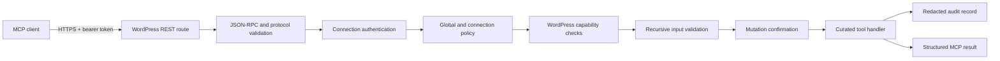

# Architecture

## Request lifecycle

Every layer can reject the request. A later layer cannot broaden access granted by an earlier layer.

## Main components

| Component | Responsibility |
| --- | --- |
| `class-xsofty-mcp-server.php` | REST routes, MCP protocol negotiation and dispatch |
| `class-xsofty-mcp-auth.php` | Connection storage, authentication, scopes, limits and audit privacy |
| `class-xsofty-mcp-tools.php` | Curated tool registry, schemas, annotations and execution |
| `class-xsofty-mcp-operations.php` | WordPress-native operational tool handlers |
| `class-xsofty-mcp-seo.php` | Yoast/Rank Math adapters, sitemap and redirect controls |
| `class-xsofty-mcp-backups.php` | Private backup and plugin-checkpoint implementation |
| `class-xsofty-mcp-jobs.php` | Asynchronous jobs, scheduling and retention |
| `class-xsofty-mcp-control.php` | Administrator approval queue and one-time execution |
| `class-xsofty-mcp-admin.php` | WordPress control center and preset policy mappings |

## Policy intersection

A tool is available only when all applicable conditions are true:

1. The bridge is enabled.
2. The request uses HTTPS, or the host qualifies for the explicit local-development exception.
3. The bearer token is valid, enabled and unexpired.
4. The connection's bound WordPress administrator remains valid.
5. Global settings have not disabled the tool.
6. The connection's scopes include the tool's scope.
7. The connection's tool allowlist permits the tool.
8. Current WordPress capabilities permit the operation.
9. Input satisfies the published schema.
10. A mutation includes literal `confirm=true`.
11. Any required administrator approval remains current and unused.

## Data handling

- WordPress stores connection hashes, not plaintext bearer secrets.
- Tokens are displayed once at creation.
- Audit records redact credential-like fields, URL queries and local paths.
- Remote addresses are pseudonymized using keyed HMAC.
- Backup archives and plugin checkpoints are created outside the public document root.
- Signed backup links are short-lived and connection-specific.

## Deliberately excluded primitives

The bridge has no generic shell, PHP, JavaScript, SQL, core editor, upload-anything or unrestricted filesystem tool. New capabilities should remain task-specific, schema-bounded and backed by native WordPress APIs.
